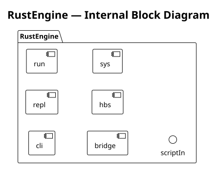

= Why Steel Scheme as the extension language
:description: The rationale for embedding Steel, and how the embedded engine works
:icons: font

== The need for scriptability in a SysML toolchain

syster-base is a library, not a monolith.
It parses SysML v2 text, builds an AST and HIR, and resolves names —
but it deliberately says nothing about _what to do_ with that information.
Generating a PlantUML diagram, checking a modelling convention, or producing a
report are all tasks that belong to a layer above the core parser.

Rather than hard-coding every such transformation in Rust,
syster-steel exposes the parsed model to a scripting layer so that users can
define their own transformations without recompiling the toolchain.

== The embedded engine architecture

syster-steel is a concrete example of
https://mattwparas.github.io/steel/book/start/embedded.html[using Steel as an embedded scripting engine].
The `steel-core` crate provides the VM;
the host Rust application (syster-steel) creates an `Engine`,
registers domain-specific types and functions,
then passes control to user-supplied Scheme scripts.

[source,rust]
----
use steel::steel_vm::engine::Engine;

fn main() {
    let mut engine = Engine::new();
    // register syster-base bindings ...
    engine.run("(load-and-run-user-script)").unwrap();
}
----

=== Engine::new

`Engine::new()` creates a fresh Steel virtual machine with the standard library
pre-loaded.

[source,rust]
----
let mut engine = Engine::new();
----

NOTE: The `Engine` is neither `Send` nor `Sync`.
It is bound to the thread on which it was created and cannot be shared across threads.
For a CLI tool that processes one model per invocation this is not a constraint.

=== Engine::run

`Engine::run` accepts any value implementing `AsRef<str> + Into<Cow<'static, str>>` —
in practice, an owned `String` — and returns `Result<Vec<SteelVal>>`.

[source,rust]
----
let results = engine.run("(+ 1 2 3 4)".to_owned())?;
// results == vec![SteelVal::IntV(10)]
----

syster-steel uses `Engine::run` for inline expressions (`-e`),
and reads script files to `String` then passes them to `Engine::run` directly.

=== Registering Rust types

The host calls `Engine::register_type::<T>()` to make a Rust struct available
as an opaque Steel value,
and `Engine::register_value` to expose accessor functions:

[source,rust]
----
engine.register_type::<HirSymbol>("HirSymbol?");
engine.register_value("hir-symbol/name",
    SteelVal::FuncV(|args| {
        // extract HirSymbol from args[0], return its name as SteelVal::StringV
    }));
----

From Steel, `HirSymbol` values are opaque handles —
you cannot inspect their fields directly;
you call the registered accessor functions.

=== Module search path

`Engine::add_search_directory` tells the VM where to look for `(require "…")` modules.
syster-steel exposes this via the `-L` CLI flag:

[source,rust]
----
for path in &cli.load_paths {
    engine.add_search_directory(path.clone());
}
----

=== The REPL

The Steel book describes `steel-repl::run_repl(engine)` as the canonical way to
embed a REPL.
syster-steel instead provides a custom REPL (in `src/repl.rs`) built on
https://crates.io/crates/rustyline[rustyline] for persistent history and
multi-line input support.
The two approaches are functionally equivalent for end users;
the custom implementation gives more control over the prompt,
parenthesis-balance detection,
and history file location.

== Why a Lisp/Scheme dialect?

Several properties make Scheme a natural fit for SysML model transformation.

*Homoiconicity.*
Scheme treats code and data uniformly as s-expressions.
A SysML model is essentially a labelled tree —
packages containing definitions containing usages —
and recursive Lisp processing of trees is idiomatic rather than awkward.

*Minimal syntax, maximum composability.*
A PlantUML generator is a function that maps a list of symbols to a string.
Scheme's `map`, `filter`, `fold`, and `string-append` express this directly,
without ceremony.

*Interactive development.*
The REPL lets you load a model and query it interactively while building a script.
This tight feedback loop is valuable when you are exploring an unfamiliar model
or debugging output.

*Extensibility through macros.*
`define-syntax` lets you define domain-specific notation without modifying the interpreter.
You could define a `with-block-defs` macro that automatically filters symbols
before passing them to a body expression.

== Why Steel specifically?

Steel is a Scheme dialect implemented in Rust that is explicitly designed for embedding.

*Safe, single-threaded embedding.*
`Engine` is not `Send` or `Sync`,
meaning it is naturally confined to one thread and carries no cross-thread risk.
This matches the single-invocation model of a CLI tool.

*R5RS compliance with Racket-style modules.*
Standard Scheme vocabulary (`car`, `cdr`, `lambda`, `define-syntax`) is familiar;
Racket-style `require`/`provide` gives a practical module system absent from the standard.

*Rust types as first-class values.*
`Engine::register_type<T>()` exposes any Rust struct as an opaque Steel value.
Accessor functions registered with `Engine::register_value()` then form a clean API
without writing unsafe FFI.

*No JVM, no GC pause.*
Unlike Groovy or Jython, embedding Steel adds no managed runtime.
Start-up is fast enough for CLI invocations that process one model at a time.

*Actively maintained.*
Steel is developed for use in https://helix-editor.com/[Helix editor] plugins,
which gives it a real-world embedding workload and motivated maintenance.

== Optional: Cranelift JIT (`jit2`)

Steel-core ships an experimental Cranelift-based JIT compiler gated behind the
`jit2` Cargo feature flag.
It is **not enabled** in syster-steel by default.

=== How the JIT works

At runtime the VM profiles lambda call counts.
When a lambda crosses a threshold it is passed to `jit_compile_lambda`,
which compiles its bytecode to native machine code via
https://cranelift.dev/[Cranelift].
The compiled function is stored alongside the bytecode;
the VM replaces the function's first opcode with `DynSuperInstruction`,
which dispatches directly to the native pointer on subsequent calls,
bypassing the bytecode interpreter loop entirely.

The `jit2` feature additionally links `cranelift-native`,
so the emitted code is optimised for the host CPU's instruction-set extensions
(SSE, AVX, etc.) rather than a generic x86-64 baseline.

=== Limitations

The JIT silently falls back to bytecode interpretation for:

* multi-arity lambdas
* functions containing `PUREFUNC` opcodes

There is no explicit opt-in or opt-out from Scheme code;
the decision is made automatically per function at call time.

=== How to enable it

Add the `jit2` feature to the `steel-core` dependency in `Cargo.toml`:

[source,toml]
----
steel-core = { version = "0.8.2", features = ["jit2"] }
----

The `jit` feature (without the `2`) also exists in the feature list but is
dead — its `#[cfg]` gates are commented out in the steel-core source.
Always use `jit2`.

=== When it is worth enabling

The JIT benefits tight numeric or recursive loops.
For syster-steel's typical workload — filtering a list of HIR symbols,
building a data hash, and calling `hbs/render` once —
the hot paths are already fast in the bytecode interpreter
and the JIT compile-time overhead may exceed any savings.
Enable it if profiling shows interpreter dispatch as a bottleneck,
or when running generation scripts over very large models.

== What Steel does _not_ replace

Steel scripts operate on an already-parsed, already-resolved model.
They do not:

* parse SysML text (that is `syster-base`'s job)
* resolve qualified names across packages (Salsa queries in `syster-base` do this)
* provide IDE features like completion or hover (that is `syster-base`'s IDE layer)

Steel scripts are transformation and generation tools, not a second parser.

== See also

* https://mattwparas.github.io/steel/book/start/embedded.html[Steel Book — Using Steel as an embedded scripting engine]
* https://cranelift.dev/[Cranelift code generator]
* xref:sysml-model-in-steel.adoc[How SysML models are represented in Steel]
* xref:plantuml-pipeline.adoc[The SysML → PlantUML → SVG pipeline]
* xref:../refer/syster-base-bindings.adoc[syster-base Steel bindings reference]
