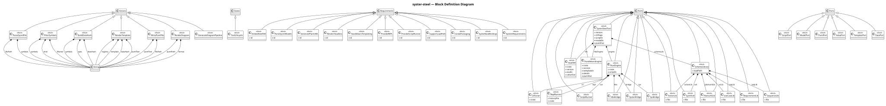

= How SysML v2 models are represented in Steel
:description: The HIR layer, HirSymbol values, SymbolKind taxonomy, and qualified-name hierarchy
:icons: font

== The two-level model

syster-base produces two representations of a SysML v2 file.

*AST* (in `parser::ast`) is a typed wrapper over the rowan Concrete Syntax Tree.
It preserves every token, including whitespace and comments.
It is used for formatting, go-to-definition, and diagnostics that need precise source locations.

*HIR* (High-level IR, in `hir`) is a flat, semantic view computed by Salsa incremental queries.
It resolves qualified names, flattens the namespace hierarchy into a symbol list,
and exposes relationships between symbols.

Steel scripts work exclusively with the *HIR*.
The AST is not exposed to Steel because it requires a reference into the CST arena,
which cannot safely cross the Rust/Steel boundary.

== HirSymbol — the central value

Every named element in a SysML model —
package, part definition, port, attribute, connection, view —
becomes one `HirSymbol`.
The symbol list is *flat*:
a `VehicleSystem` that contains an `Engine` part usage produces two separate `HirSymbol` values.
Hierarchy is recoverable from qualified names.

From Steel, a `HirSymbol` is an opaque handle registered via `Engine::register_type`.
Its fields are read through accessor functions registered by the host application.

[cols="2,1,3"]
|===
| Accessor | Returns | Notes

| `(hir-symbol/name sym)`
| string
| Simple name, e.g. `"Engine"`

| `(hir-symbol/qualified-name sym)`
| string
| `"::"` separated, e.g. `"VehicleModel::Engine"`

| `(hir-symbol/kind sym)`
| string
| See SymbolKind strings below

| `(hir-symbol/is-abstract? sym)`
| boolean
|

| `(hir-symbol/is-variation? sym)`
| boolean
|

| `(hir-symbol/is-readonly? sym)`
| boolean
|

| `(hir-symbol/is-derived? sym)`
| boolean
|

| `(hir-symbol/direction sym)`
| string or `#f`
| `"In"`, `"Out"`, `"InOut"`

| `(hir-symbol/multiplicity sym)`
| list or `#f`
| `(list lower upper)`; `upper` is `-1` when unbounded

| `(hir-symbol/doc sym)`
| string or `#f`
| Documentation comment text

| `(hir-symbol/supertypes sym)`
| list of string
| Qualified names of specialization targets

| `(hir-symbol/relationships sym)`
| list of `HirRelationship`
|

| `(hir-symbol/file sym)`
| string
| Source file path

| `(hir-symbol/line sym)`
| integer
| 1-based start line
|===

== SymbolKind strings

A kind string directly names the `SymbolKind` enum variant on the Rust side.

.Definitions
[cols="2,3"]
|===
| Kind string | SysML v2 construct

| `"Package"` | `package Foo { … }`
| `"PartDefinition"` | `part def Foo { … }`
| `"ItemDefinition"` | `item def Foo { … }`
| `"AttributeDefinition"` | `attribute def Mass { … }`
| `"PortDefinition"` | `port def DrivePort { … }`
| `"ConnectionDefinition"` | `connection def PowerFlow { … }`
| `"InterfaceDefinition"` | `interface def …`
| `"AllocationDefinition"` | `allocation def …`
| `"ActionDefinition"` | `action def Start { … }`
| `"CalculationDefinition"` | `calc def …`
| `"StateDefinition"` | `state def OperationalState { … }`
| `"RequirementDefinition"` | `requirement def SafetyReq { … }`
| `"ConstraintDefinition"` | `constraint def …`
| `"UseCaseDefinition"` | `use case def …`
| `"AnalysisCaseDefinition"` | `analysis def …`
| `"ConcernDefinition"` | `concern def …`
| `"ViewDefinition"` | `view def SystemView { … }`
| `"ViewpointDefinition"` | `viewpoint def StakeholderVP { … }`
| `"RenderingDefinition"` | `rendering def …`
| `"EnumerationDefinition"` | `enum def …`
| `"MetadataDefinition"` | `metadata def …`
| `"Interaction"` | `interaction …`
| `"Class"` | `class …`
| `"DataType"` | `datatype …`
| `"Structure"` | `struct …`
| `"Behavior"` | `behavior …`
| `"Function"` | `function …`
| `"Association"` | `assoc …`
|===

.Usages
[cols="2,3"]
|===
| Kind string | SysML v2 construct

| `"PartUsage"` | `part foo : Foo;`
| `"AttributeUsage"` | `attribute mass : Real;`
| `"PortUsage"` | `port driveOut : DrivePort;`
| `"ItemUsage"` | `item foo : Foo;`
| `"ConnectionUsage"` | `connect engine.driveOut to chassis;`
| `"FlowConnectionUsage"` | `flow …`
| `"InterfaceUsage"` | `interface …`
| `"AllocationUsage"` | `allocate …`
| `"ActionUsage"` | `action start : Start;`
| `"CalculationUsage"` | `calc …`
| `"StateUsage"` | `state operationalState : OperationalState;`
| `"TransitionUsage"` | `transition … then …`
| `"RequirementUsage"` | `requirement safetyReq : SafetyReq;`
| `"ConstraintUsage"` | `constraint …`
| `"OccurrenceUsage"` | `occurrence …`
| `"ViewUsage"` | `view systemView : SystemView { … }`
| `"ViewpointUsage"` | `viewpoint …`
| `"RenderingUsage"` | `rendering …`
| `"ReferenceUsage"` | `ref …`
| `"ExposeRelationship"` | `expose …`
|===

== Relationships

A `HirRelationship` records a directed typed edge from one symbol to another.

[source,scheme]
----
(hir-rel/kind rel)    ; string — relationship type
(hir-rel/target rel)  ; string — qualified name of the target symbol
----

[cols="2,3"]
|===
| Kind string | Meaning

| `"TypedBy"` | `part foo : Engine` — foo is typed by Engine
| `"Specializes"` | `part def ElectricEngine :> Engine`
| `"Redefines"` | `:>>` redefines a feature
| `"Subsets"` | `subsets` relationship
| `"References"` | cross-reference to another element
| `"Satisfies"` | `satisfy` requirement
| `"Performs"` | `perform` action
| `"Exhibits"` | `exhibit` state
| `"Includes"` | `include` use case
| `"Asserts"` | `assert` constraint
| `"Verifies"` | `verify` requirement
|===

== Qualified names and hierarchy

Steel scripts reconstruct hierarchy by examining qualified names.
A symbol `"VehicleModel::VehicleSystem::engine"` is a direct child of
`"VehicleModel::VehicleSystem"`.
Depth equals the number of `::` separators plus one.

[source,scheme]
----
(define (qname-depth qn)
  (length (string-split qn "::")))

(define (direct-child? parent-sym child-sym)
  (let ([pqn (hir-symbol/qualified-name parent-sym)]
        [cqn (hir-symbol/qualified-name child-sym)])
    (and (starts-with? cqn (string-append pqn "::"))
         (= (qname-depth cqn) (+ 1 (qname-depth pqn))))))
----

The diagram below shows the syster-steel system model itself as a Block Definition Diagram.
Each `<<block>>` corresponds to one `HirSymbol` of kind `PartDefinition`;
nesting is encoded in qualified names such as `SysterSteel::RustEngine::bridge`.

== Views and ViewData

Symbols of kind `"ViewDefinition"` or `"ViewUsage"` carry extra data.

[source,scheme]
----
(hir-symbol/view-expose sym)      ; list of expose paths (strings)
(hir-symbol/view-rendering sym)   ; string or #f — rendering definition name
----

A `ViewDefinition` uses `expose` clauses to declare which model elements it presents.
The PlantUML generator uses these to filter the symbol list before generating
diagram content.

== See also

* xref:plantuml-pipeline.adoc[The SysML → PlantUML → SVG pipeline]
* xref:../refer/syster-base-bindings.adoc[syster-base Steel bindings reference]
* xref:../instruct/load-sysml-model.adoc[How to load a SysML model]
