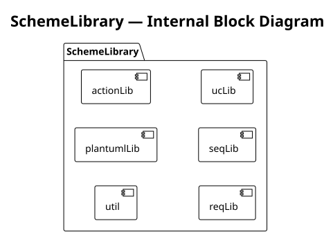

= Script library structure
:description: Layout and loading conventions for the steel/ Steel Scheme library suite
:icons: font

The `steel/` directory is organized as a suite of Steel Scheme libraries.
`plantuml.scm` is the recommended entry point for generating PlantUML source —
it defines all diagram generators inline and provides a unified API without
requiring sub-library imports.

`dot.scm` is the companion library that generates DOT-language graphs for the
same eight diagram types and renders them to SVG in-process via the
`layout/render-dot` Rust binding.  The generation tasks (`gen-diagrams`,
`gen-self`) use both libraries together: `plantuml.scm` writes `.puml` files for
reference, and `dot.scm` + `layout/render-dot` produce the `.svg` files used in
documentation.

The sub-library files (`plantuml-action.scm`, etc.) are standalone alternatives
for scripts that need only one diagram type and want to manage their own
Handlebars registry.

NOTE: Steel closures store name references rather than captured values, so
cross-module function capture (the pattern `(define alias imported-fn)`) does
not work across module boundaries.  All generators in `plantuml.scm` and
`dot.scm` are therefore implemented inline — not delegated to sub-libraries —
so that every closure resolves its references within the same module scope.

== File layout

----
steel/
├── sysml-util.scm            — Shared utilities (pu-alias, filter-kind, rel-targets, …)
├── plantuml.scm              — All-in-one: all PlantUML generators + *hbs* registry
│                               Writes .puml source files (inline, no sub-library requires)
├── dot.scm                   — DOT language generators for all 8 diagram types
│                               Uses layout/render-dot (Rust binding) to produce .svg
├── plantuml-action.scm       — Standalone action flow generator  (explicit hbs arg)
├── plantuml-requirement.scm  — Standalone requirement generator  (explicit hbs arg)
├── plantuml-sequence.scm     — Standalone sequence generator     (explicit hbs arg)
├── plantuml-use-case.scm     — Standalone use case generator     (explicit hbs arg)
├── gen-plantuml.scm          — Campaign batch script  (uses plantuml.scm)
├── gen-self-diagrams.scm     — Self-documenting diagrams from data/self/
├── gen-bdd.scm               — Standalone BDD script
├── templates/
│   ├── bdd.hbs               — Block Definition Diagram
│   ├── ibd.hbs               — Internal Block Diagram
│   ├── state-machine.hbs     — State machine
│   ├── package.hbs           — Package diagram
│   ├── viewpoints.hbs        — Viewpoints / view definitions
│   ├── action-flow.hbs       — Action flow diagram
│   ├── requirement.hbs       — Requirement diagram
│   ├── sequence.hbs          — Sequence diagram
│   ├── use-case.hbs          — Use case diagram
│   └── allocation.hbs        — Allocation diagram (template; generator pending)
└── examples/
    ├── hello.scm
    ├── greetings.scm
    └── vehicle-diagrams.scm
----

== Dependency graph

----
plantuml.scm
  └── requires sysml-util.scm          (utilities only)
      Produces: .puml source (via hbs/render + Handlebars templates)

dot.scm
  └── requires sysml-util.scm
      Produces: .svg (via layout/render-dot Rust binding → layout-rs crate)

plantuml-action.scm
  └── requires sysml-util.scm

plantuml-requirement.scm
  └── requires sysml-util.scm

plantuml-sequence.scm
  └── requires sysml-util.scm

plantuml-use-case.scm
  └── requires sysml-util.scm
----

Steel caches module loads, so `sysml-util.scm` is evaluated only once even
when multiple libraries require it.

== Java pilot implementation correspondence

[cols="2,2,3"]
|===
| Scheme library | Java class(es) | Diagram type

| `plantuml.scm` — `generate-bdd` | `VCompartment` / `VTree` | Block Definition Diagram
| `plantuml.scm` — `generate-ibd` | `VComposite` | Internal Block Diagram
| `plantuml.scm` — `generate-state-machine` | `VStateMachine` / `VStateMembers` | State machine
| `plantuml.scm` — `generate-package-diagram` | `VDefault` (package traversal) | Package diagram
| `plantuml.scm` — `generate-viewpoints-diagram` | `VDefault` (viewpoint traversal) | Viewpoints
| `plantuml.scm` — `generate-action-flow` | `VAction` / `VActionMembers` | Action flow
| `plantuml.scm` — `generate-requirement-diagram` | `VRequirement` / `VCompartment` | Requirement
| `plantuml.scm` — `generate-sequence-diagram` | `VSequence` | Sequence (simplified)
| `plantuml.scm` — `generate-use-case-diagram` | `VCase` / `VCaseMembers` | Use case
|===

The standalone sub-libraries (`plantuml-action.scm`, etc.) mirror each generator
but take an explicit `hbs` registry as their first argument.
They are useful when you want to use one diagram type without loading the full suite.

== Loading the full suite

[source,scheme]
----
; Run with: syster-steel -L steel steel/my-script.scm
(require "plantuml.scm")

(define model   (syster/parse-file "data/model.sysml"))
(define symbols (syster/file-symbols model))

(write-plantuml-file (generate-bdd symbols) "out/bdd.puml")
(write-plantuml-file (generate-requirement-diagram symbols) "out/requirements.puml")
----

== Loading a single sub-library

Each sub-library can be loaded independently alongside `sysml-util.scm`.
The sub-library generators take an explicit `hbs` registry as their first
argument when called directly:

[source,scheme]
----
(require "sysml-util.scm")
(require "plantuml-requirement.scm")

(define my-hbs (make-requirement-hbs "steel/templates"))
(define model  (syster/parse-file "data/model.sysml"))
(define syms   (syster/file-symbols model))

(write-plantuml-file
  (generate-requirement-diagram my-hbs syms (hash "title" "My Requirements"))
  "out/requirements.puml")
----

When loaded via `plantuml.scm`, the `hbs` parameter is bound automatically to
the shared `*hbs*` registry — callers do not pass it.

== Extending with custom templates

All sub-library `make-*-hbs` factories accept a `templates-dir` path and
register only the templates they need.  To add your own templates to the
shared registry after loading `plantuml.scm`:

[source,scheme]
----
(require "plantuml.scm")
(hbs/register-template-file! *hbs* "my-diagram" "my/templates/my-diagram.hbs")
(hbs/render *hbs* "my-diagram" data-hash)
----

== Host-registered functions always available

The following functions are registered by the Rust host and available in all
scripts without any `require`:

* `hbs/*` — Handlebars template engine (see xref:hbs-bindings.adoc[])
* `syster/*` — SysML v2 model loading (see xref:syster-base-bindings.adoc[])
* `hir-symbol/*`, `hir-rel/*` — HIR accessor functions
* `layout/render-dot` — DOT → SVG layout engine (backed by the `layout-rs` crate; used by `dot.scm`)
* `system` — run a shell command via `/bin/sh -c`
* `glob-list` — expand a glob pattern into a list of path strings

== See also

* xref:plantuml-procedures.adoc[PlantUML generation procedures reference]
* xref:hbs-bindings.adoc[Handlebars Steel bindings reference]
* xref:syster-base-bindings.adoc[syster-base Steel bindings reference]
