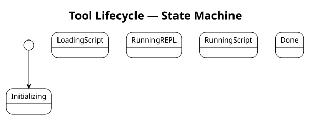

= Tutorial 1 — Getting started with syster-steel
:description: First steps with the REPL and script files
:icons: font

This tutorial walks you through your first session with the syster-steel REPL and
your first script file.
By the end you will be able to write and run Steel Scheme expressions,
define functions,
and work with lists and strings.

No prior Scheme knowledge is assumed;
basic familiarity with a command line is enough.

NOTE: syster-steel embeds the https://mattwparas.github.io/steel/book/[Steel Scheme]
interpreter via the `steel-core` crate.
The `Engine` object runs all expressions — in the REPL, from script files,
and from the `-e` flag — within a single, persistent VM instance.

== 1. Start the REPL

----
syster-steel
----

You should see:

----
syster-steel v0.1.0
Steel Scheme — type (exit) or Ctrl-D to quit, Ctrl-C to cancel input.
>
----

The `>` prompt means the interpreter is waiting for input.

== 2. Arithmetic

Type each line and press Enter.
The result appears on the next line.

[source,scheme]
----
(+ 1 2)
(* 6 7)
(/ 22 7)
(expt 2 10)
----

----
3
42
3.142857142857143
1024
----

All arithmetic uses prefix notation:
the operator comes first, then the operands.

== 3. Strings and display

[source,scheme]
----
(string-append "Hello" ", " "SysML!")
(displayln "Hello, SysML!")
----

----
"Hello, SysML!"
Hello, SysML!
----

`displayln` prints the value without surrounding quotes and adds a newline.
`string-append` joins strings without printing.

== 4. Defining values and functions

Use `define` to name a value or a function.

[source,scheme]
----
(define pi 3.14159)
(* 2 pi)
(define (circle-area r) (* pi r r))
(circle-area 5)
----

----
6.28318
78.53975
----

The form `(define (name args...) body)` is shorthand for
`(define name (lambda (args...) body))`.

== 5. Lists

Lists are the fundamental data structure in Steel.

[source,scheme]
----
(list 1 2 3 4 5)
----
----
'(1 2 3 4 5)
----
[source,scheme]
----
(car (list 1 2 3))
----
----
1
----
[source,scheme]
----
(cdr (list 1 2 3))
----
----
'(2 3)
----
[source,scheme]
----
(length (list "a" "b" "c"))
----
----
3
----
[source,scheme]
----
(map (lambda (x) (* x x)) (list 1 2 3 4))
----
----
'(1 4 9 16)
----
[source,scheme]
----
(filter odd? (list 1 2 3 4 5))
----
----
'(1 3 5)
----

== 6. Multi-line input

The REPL waits for balanced parentheses before evaluating.
You can spread an expression across multiple lines:

[source,scheme]
----
(define (greet name)
  (string-append "Hello, " name "!"))
(greet "world")
----

----
"Hello, world!"
----

The `..` prompt signals that the expression is incomplete.
Press *Ctrl-C* to abandon a partially-typed expression.

== 7. Write your first script

Save the following as `hello.scm`
(the full example is at `script/examples/hello.scm`):

[source,scheme]
----
include::../../script/examples/hello.scm[]
----

Run it:

----
syster-steel hello.scm
----

Output:

----
Hello, SysML!
Hello, Steel!
----

== 8. Run a script then keep the REPL open

----
syster-steel -i hello.scm
----

The `-i` flag runs the script and then drops into the REPL,
with all definitions from `hello.scm` still in scope:

[source,scheme]
----
(greet "you")
----

----
"Hello, you!"
----

Because syster-steel uses a single `Engine` instance for the entire session,
definitions accumulate across scripts and REPL input.

The diagram above shows the tool's lifecycle:
the same `Engine` transitions from `Initializing` through `LoadingScript` and
into either `RunningREPL` (interactive) or `RunningScript` (batch),
then exits when the session ends.

== 9. Load a script from the REPL

You can load a script file from within a running REPL session without restarting.
There are two ways to do this.

=== `load` — re-execute a file unconditionally

`load` evaluates every expression in the file as if you had typed them at the prompt.
It re-executes on every call, which makes it useful when you are editing a script
and want to reload your changes mid-session.

Start the REPL and load `hello.scm`:

[source,scheme]
----
(load "hello.scm")
(greet "world")
----

----
Hello, SysML!
Hello, Steel!
"Hello, world!"
----

Edit `hello.scm` in your editor, then reload it without leaving the REPL:

[source,scheme]
----
(load "hello.scm")
----

All definitions in the file are re-evaluated and updated in place.

=== `require` — load a module once

`require` loads a file, evaluates it, and brings its `(provide ...)`-exported
names into scope.
Unlike `load`, it is cached — requiring the same path a second time is a no-op.
Use `require` for library modules you want to import cleanly.

Create `greetings.scm` with an explicit export
(the full example is at `script/examples/greetings.scm`):

[source,scheme]
----
include::../../script/examples/greetings.scm[]
----

Then from the REPL:

[source,scheme]
----
(require "greetings.scm")
(greet "Steel")
----

----
"Hello, Steel!"
----

=== Which to use?

[cols="1,1,1"]
|===
| | `load` | `require`

| Re-executes on repeat calls | yes | no — cached
| Needs `(provide ...)` | no | yes, to export names
| Good for | iterating on a script | importing a library
|===

== 10. Exit

Type `(exit)` or press *Ctrl-D*.

== What next?

* xref:02-loading-a-sysml-model.adoc[Tutorial 2 — Loading a SysML model]
* xref:../instruct/run-a-script.adoc[How-to: Run a script]
* xref:../refer/steel-quick-reference.adoc[Reference: Steel language quick reference]
