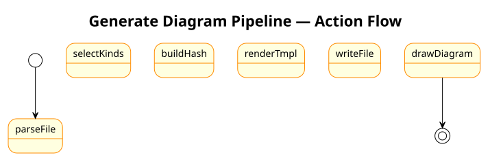

= Tutorial 3 — Generating a PlantUML diagram end-to-end
:description: From a SysML v2 model to a rendered SVG Block Definition Diagram
:icons: font

This tutorial takes you from a SysML v2 model file all the way to a rendered SVG
Block Definition Diagram (BDD),
using Steel scripts to drive the conversion.

*Prerequisites:* complete xref:02-loading-a-sysml-model.adoc[Tutorial 2].
You need `plantuml` on your `PATH` — verify with `plantuml -version`.

The diagram below shows the full generation pipeline you will follow in this tutorial:

== 1. The model

Use `vehicle.sysml` from Tutorial 2 (`data/docs/vehicle.sysml`):

[source,sysml]
----
include::../../data/docs/vehicle.sysml[]
----

== 2. Write the generation script

The script `script/gen-bdd.scm` implements the pipeline end-to-end:

[source,scheme]
----
include::../../script/gen-bdd.scm[]
----

== 3. Run the script

----
syster-steel script/gen-bdd.scm
----

[source,scheme]
----
;;; ── main ─────────────────────────────────────────────────────────────────
(generate-bdd "vehicle.sysml" "vehicle-bdd.puml")
----

Output:

----
Wrote vehicle-bdd.puml
----

Inspect the generated file:

----
cat vehicle-bdd.puml
----

[source,text]
----
@startuml
skinparam classBackgroundColor<<block>> LightSteelBlue

class "VehicleSystem" <<block>> {
  + mass : Real
  ~ drivePort
}

class "Engine" <<block>> {
  + power : Real
  ~ fuelIn
  ~ driveOut
}

class "Chassis" <<block>> {
  + weight : Real
}

"VehicleSystem" *-- "Engine" : engine
"VehicleSystem" *-- "Chassis" : chassis

@enduml
----

== 4. Render to SVG

----
plantuml -svg vehicle-bdd.puml
----

This creates `vehicle-bdd.svg` in the same directory as the `.puml` file.
Open it in any browser or SVG viewer.

To render to PNG instead:

----
plantuml -png vehicle-bdd.puml
----

== 5. Automate rendering from Steel

Add these lines to the end of `generate-bdd.scm` to render automatically:

[source,scheme]
----
(define (render-plantuml puml-path format)
  (let ([flag (string-append "-" format)])
    (run-process (list "plantuml" flag puml-path))))

(render-plantuml "vehicle-bdd.puml" "svg")
(displayln "Rendered vehicle-bdd.svg")
----

Now a single invocation does everything:

----
syster-steel generate-bdd.scm
----

== What next?

* xref:../instruct/generate-plantuml-diagram.adoc[How-to: Generate a PlantUML diagram] — other diagram types
* xref:../instruct/render-diagrams.adoc[How-to: Render diagrams] — format options
* xref:../refer/plantuml-procedures.adoc[Reference: PlantUML generation procedures]
* xref:../explain/plantuml-pipeline.adoc[Explanation: The SysML → PlantUML → SVG pipeline]
